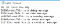
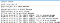
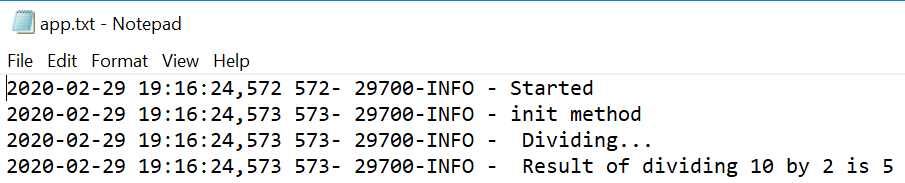
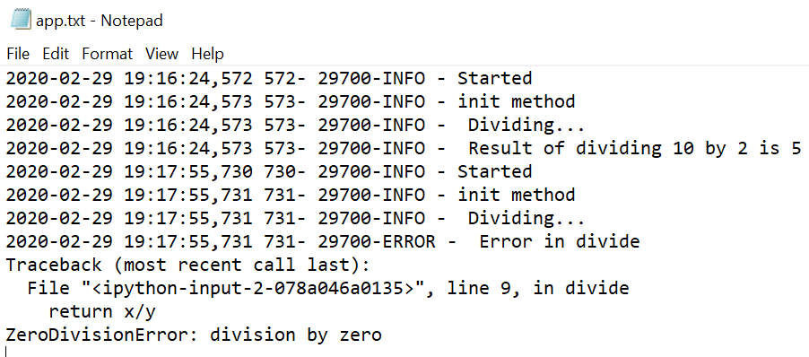

# Logging

# Logging in Python

> Learn to log messages for troubleshooting code in Python

## Learn to log messages for troubleshooting code in Python

[https://arshren.medium.com/?source=post_page-----12e0c0528dd6--------------------------------](https://arshren.medium.com/?source=post_page-----12e0c0528dd6--------------------------------)

- What is logging?
- Why is it required?
- How to log formatted messages?
- How can we log messages for python classes and function?
- How to write log messages to files?
- How to log stack trace?

You have created classes and functions in Python, and you are getting undesired results or, the code is deployed in production and has started giving undesired results.

***How do you debug the code to identify and resolve the root cause?***

**Logging is the process of recording the flow of code as it executes along with capturing any other events that occur during execution like Out Of Memory(OOM) issues or hard disk issues**. Logging is usually done in files that can be retrieved later for analysis or troubleshooting.

Using logs, we can capture the key information in the classes and function of our code.

**Log helps with**

- **Debugging the code to identify the flow of the source code during development and after deployment**
- **Alert for an exceptional event caused by the code like Out of memory etc.**
- **Finding the users or systems accessing the code**

***What should you capture as part of the logs that will help to troubleshoot?***

Logs should be very detailed containing a descriptive message containing

- **Access details**: Users or devices accessing the model
- **Code version**: The current version of the model being used
- **Timestamp**: Capture timestamp of all key events like when the incoming data was read, when the prediction was made etc.
- **Results**: The results of variables computed in the code
- **Exceptions** that occur along with a Stack trace
- **Code flow**: Different classes and functions called during execution

***How to implement logging in Python?***

**Python provides a library “logging” to write messages** to a file or any other output stream like the standard output.

**Different levels of logging in the order of their severity**

1. **DEBUG**: Used only when diagnosing problems
2. **INFO**: Just for information, used for understanding the code flow when diagnosing the problem
3. **WARNING**: When an unexpected situation occurs, but the code is still running
4. **ERROR**: When the code is not able to perform some function
5. **CRITICAL**: Serious error when the program is unable to continue running

A simple code to use logging and different severity options

\#code: #logging:

**import logging

logging.debug('This is a debug message')

[logging.info](http://logging.info)('This is an info message')

logging.warning('This is a warning message')

logging.error('This is an error message')

logging.critical('This is a critical message')**

.png)

output in console

We log message structure is severity level like ***WARNING,*** followed by the default logging module ***root,*** followed by the ***message.***

**We see that debug and info messages are not displayed. Logging module by default only displays messages with a severity level of warning and above**

***What if you are debugging the code and want to show the messages for severity levels of Debug and Info?***

We use ***basicConfig()*** to set basic configuration for the logging system.

**import logging****logging.basicConfig(level=logging.debug)****logging.debug('This is a debug message')

[logging.info](http://logging.info)('This is an info message')

logging.warning('This is a warning message')

logging.error('This is an error message')

logging.critical('This is a critical message')**

.png)

output in console

***basicConfig()*** will not take new settings into considerations if the root logger is already configured. I had to restart my kernel for the above code to work properly as the first time any of the logging function is called it configures the root logger internally.

**Common basicConfig() parameters**

**filename**: Specify the filename to which we want to write the log message

**filemode**: Specify the mode in which the file needs to be opened like ‘w’ for write, ‘a’ for append. Default file mode is ‘a’

**format**: Specify the format string available as attributes in [LogRecord](https://docs.python.org/3.8/library/logging.html?highlight=logrecord#logrecord-attributes)

**datefmt**: Specify the date format we want in the log messages. The format should be accepted by ***time.strftime()***

**level**: Severity level that you want to set for the root logger

## Writing log message to a log.txt file in append mode with a severity level of DEBUG

**import logging

logging.basicConfig(filename='log.txt', filemode='a', level=logging.DEBUG)****logging.debug('This is a debug message')

[logging.info](http://logging.info)('This is an info message')

logging.warning('This is a warning message')

logging.error('This is an error message')

logging.critical('This is a critical message')**

.png)

log.txt log file with the log messages

## Writing formatted log message to a log.txt file in append mode with a severity level of DEBUG

**import logging

logging.basicConfig(filename='log.txt', filemode='a',
format='%(asctime)s %(msecs)d- %(process)d
-%(levelname)s - %(message)s',
datefmt='%d-%b-%y %H:%M:%S %p' ,
level=logging.DEBUG)****logging.debug('This is a debug message')

[logging.info](http://logging.info)('This is an info message')

logging.warning('This is a warning message')

logging.error('This is an error message')

logging.critical('This is a critical message')**

.png)

log.txt log file with formatted log messages

## Logging messages in classes and functions

The following code snippet will demonstrate logging in classes and function.

We create a TestLog class with the divide(); it takes two parameters and returns the division. In case there is an error in the division, we want to have the stack trace in the log file

**import logging

class TestLog:
def __init__(self): [logging.info](http://logging.info)('init method')
def divide(self, x, y):
try:** l[**ogging.info**](http://ogging.info)**(" Dividing...")
return x/y
except Exception as e:
logging.error(" Error in divide", exc_info=True)**

Creating an instance of the TestLog class and calling divide()

**import logging****logging.basicConfig(filename='app.txt', filemode='a',level=logging.DEBUG, format='%(asctime)s %(msecs)d- %(process)d-%(levelname)s - %(message)s')****[logging.info](http://logging.info)('Started')

x=10

y=2

t= TestLog()

num_1= t.divide(x,y)**[**logging.info**](http://logging.info)**(" Result of dividing %d by %d is %d", x, y,num_1)**

log messages in app.txt

## Logging stack trace

For displaying a stack trace, we need to set **exc_info as True** in the **except** block of the Exception handling as done in the TestLog class

**[logging.info](http://logging.info)('Started')

x=10

y=0

t= TestLog()

num_1= t.divide(x,y)

[logging.info](http://logging.info)(" Result of dividing %d by %d is %d", x, y,num_1)**

Stack trace

## Conclusion:

Logging helps troubleshoot the application during development or after production deployment. Logging can be written in files or standard output using multiple formats, and we can also capture the stack trace.

## References:

[https://docs.python.org/3/howto/logging-cookbook.html](https://docs.python.org/3/howto/logging-cookbook.html)

[Source](https://towardsdatascience.com/logging-in-python-12e0c0528dd6)

